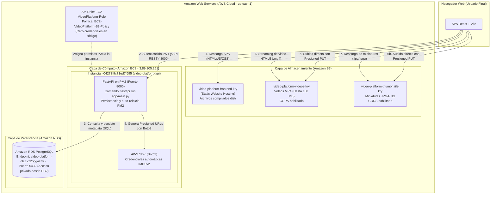

# Arquitectura del Sistema - Plataforma de Videos AWS

Este documento describe la arquitectura completa en la nube de Amazon Web Services (AWS) implementada para la Plataforma de Videos utilizando **React SPA**, **FastAPI**, **Amazon S3**, **Amazon EC2** y **Amazon RDS**.

---

## 1. Parámetros Reales de la Infraestructura Desplegada

| Componente | Parámetro | Valor Configurado |
| :--- | :--- | :--- |
| **Amazon EC2** | ID de Instancia | `i-04273f9c71ed7f695` |
| | Nombre | `video-platform-api` |
| | SO y Arquitectura | Ubuntu 26.04 / 24.04 LTS (amd64) |
| | Tipo de Instancia | `t3.micro` |
| | Zona de Disponibilidad | `us-east-1c` |
| | IPv4 Pública | `3.89.105.251` |
| | IPv4 Privada | `172.31.29.57` |
| | Security Group | `video-platform-ec2-sg` (`sg-03936b6c3db887868`) |
| | Puertos Abiertos | `22` (SSH), `8000` (FastAPI / Uvicorn) |
| **Amazon RDS** | Identificador | `video-platform-db` |
| | Motor y Versión | PostgreSQL 18.3 (compatible con cliente psycopg2) |
| | Clase de Instancia | `db.t3.micro` |
| | Endpoint de Conexión | `video-platform-db.c2z26ggasfw5.us-east-1.rds.amazonaws.com` |
| | Puerto | `5432` |
| | Usuario Maestro | `postgres` |
| | Base de Datos Activa | `postgres` (o `videoplatform`) |
| | Security Group | `sg-database-rds` (`sg-04e61852f6ffaed59`) |
| | Regla de Entrada | Puerto `5432` restringido a `sg-03936b6c3db887868` |
| **AWS IAM** | Rol de IAM | `EC2-VideoPlatform-Role` |
| | Política Adjunta | `EC2-VideoPlatform-S3-Policy` |
| | Servicio de Confianza | `ec2.amazonaws.com` |
| | Permisos Otorgados | `s3:PutObject`, `s3:GetObject`, `s3:DeleteObject`, `s3:ListBucket` |
| **Amazon S3** | Región | `us-east-1` (EE.UU. Este - N. Virginia) |
| | Bucket Frontend | `video-platform-frontend-kry` |
| | Bucket Videos | `video-platform-videos-kry` |
| | Bucket Miniaturas | `video-platform-thumbnails-kry` |

---

## 2. Diagrama de Arquitectura Global

---

## 3. URLs y Endpoints de Consumo para la Documentación

### 3.1. URLs Públicas de Acceso

- **Aplicación Web (SPA en Amazon S3)**:
  `http://video-platform-frontend-kry.s3-website-us-east-1.amazonaws.com`
- **API Backend (FastAPI en Amazon EC2)**:
  `http://3.89.105.251:8000`
- **Documentación Interactiva (Swagger UI)**:
  `http://3.89.105.251:8000/docs`
- **Documentación Alternativa (ReDoc)**:
  `http://3.89.105.251:8000/redoc`
- **Healthcheck del Sistema y RDS**:
  `http://3.89.105.251:8000/health`

### 3.2. Catálogo de Endpoints de la API

| Módulo | Método | Endpoint | Descripción |
| :--- | :--- | :--- | :--- |
| **General** | `GET` | `/` | Información de la API y enlaces de documentación |
| | `GET` | `/health` | Health check con verificación activa de SELECT 1 en RDS |
| **Usuarios** | `POST` | `/users` | Registro de usuario (nombre, correo único, contraseña con hash) |
| | `POST` | `/login` | Inicio de sesión y retorno de token JWT |
| | `GET` | `/users/{id}` | Perfil de usuario con contador de videos |
| **Videos** | `GET` | `/videos` | Catálogo de videos con paginación (`page`, `limit`) y búsqueda (`q`) |
| | `GET` | `/videos/{id}` | Detalle completo de un video por ID |
| | `POST` | `/videos/presigned-url` | Genera Presigned URLs de S3 para subida directa desde el navegador |
| | `POST` | `/videos/direct` | Registra metadata en RDS tras la subida exitosa a S3 |
| | `POST` | `/videos` | Subida streaming multipart tradicional (fallback) |
| | `POST` | `/videos/{id}/views` | Incremento atómico del contador de vistas desacoplado |
| | `PUT` | `/videos/{id}` | Actualización de título y descripción (solo propietario) |
| | `DELETE` | `/videos/{id}` | Eliminación física del registro en RDS y objetos en S3 |
| **Comentarios** | `GET` | `/videos/{id}/comments` | Listado paginado de comentarios de un video |
| | `POST` | `/videos/{id}/comments` | Publicación de un nuevo comentario (requiere autenticación JWT) |

---

## 4. Matriz de Grupos de Seguridad (Security Groups)

| Grupo de Seguridad | ID en AWS | Dirección | Protocolo | Puerto | Origen / Destino | Propósito |
| :--- | :--- | :--- | :--- | :--- | :--- | :--- |
| **`video-platform-ec2-sg`** | `sg-03936b6c3db887868` | Inbound | TCP | `8000` | `0.0.0.0/0` | Tráfico web de la SPA hacia FastAPI y Swagger |
| | | Inbound | TCP | `22` | `0.0.0.0/0` (o IP admin) | Conexión SSH para administración de la instancia |
| | | Outbound | Todos | Todos | `0.0.0.0/0` | Acceso a Internet, paquetes Ubuntu, S3 y RDS |
| **`sg-database-rds`** | `sg-04e61852f6ffaed59` | Inbound | TCP | `5432` | `sg-03936b6c3db887868` | **Restricción estricta**: solo la EC2 puede conectar a PostgreSQL |
| | | Outbound | Todos | Todos | `0.0.0.0/0` | Respuestas de consultas de la base de datos |

---

## 5. Arquitectura de Subida Directa a S3 (Presigned URLs)

Para proteger los recursos de la instancia `t3.micro` en EC2 (1 GB de RAM) ante subidas simultáneas de archivos de video:
1. El frontend solicita al endpoint `/videos/presigned-url` dos URLs pre-firmadas temporales (1 hora).
2. FastAPI usa Boto3 con los permisos del rol `EC2-VideoPlatform-Role` para firmar URLs criptográficas de subida (`PUT`) dirigidas a `video-platform-videos-kry` y `video-platform-thumbnails-kry`.
3. El navegador web sube los binarios mediante HTTP `PUT` directamente a los buckets de Amazon S3, mostrando el porcentaje de progreso en tiempo real mediante Axios `onUploadProgress`.
4. Una vez completada la carga en S3, el navegador envía la clave única (`video_key` y `thumbnail_key`) al endpoint `/videos/direct`.
5. FastAPI valida la existencia y extensión de las claves y guarda los metadatos correspondientes en PostgreSQL (Amazon RDS).
